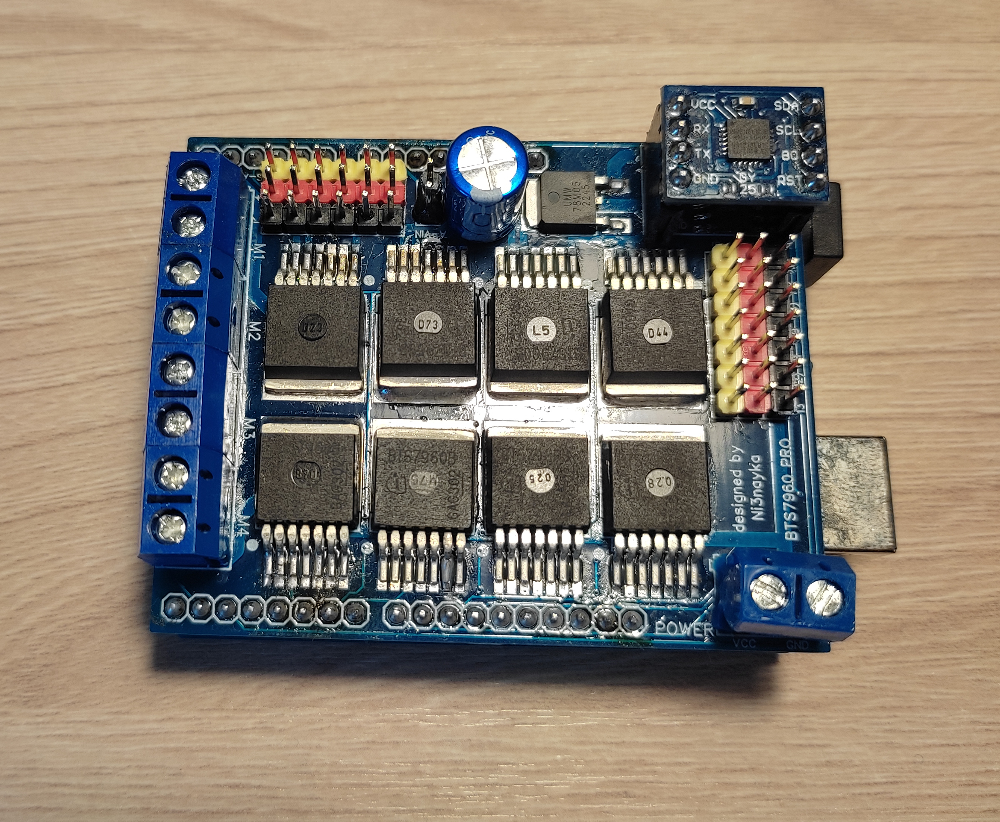

# BTS7960_PRO
Library for using motorShield BTS7960 PRO with Arduino Uno

### Установка:
1) Скачайте библиотеку и поместите ее в папку с библиотеками:
    1) (windows) ..\Documents\Arduino\libraries\
    2) (linux) ~/Arduino/libraries/
2) Откройте Arduino IDE
3) Откройте пример Файл/Примеры/BTS7960_PRO/...

### Поддерживаемые платформы:
Arduino Uno и совместимые с ней (форм-фактором) платы

### Ссылки:
1) https://vk.com/wall381491469_539
2) 
